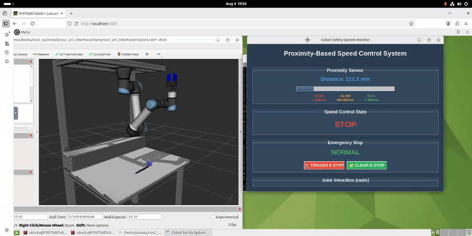

# `cobot_sim`

`cobot_sim` implements a proximity-based speed control and emergency-stop system for a UR5 cobot under ROS2.





## System Architecture


## Features

- **ProximitySensorNode**: Simulates distance readings (200–1200 mm).  
- **SpeedControllerNode**: Hysteresis state machine (`UNKNOWN`, `FULL`, `SLOW`, `STOP`).  
- **EmergencyStopMonitorNode**: Aggregates GUI, file, and hardware e-stop signals.
- **RobotMotionControlNode**: Sends trajectories and zero-velocity commands; handles dynamic speed scaling and e-stop. This was not required, but had to be implemented for showcasing the robot moving in gazebo.
- **VisualizerNode**: Creates the GUI for displaying robot, sensor, estop states, as well as interface for estop triggering and clearing.
- **StateLoggerNode**: Logs the state transitions into a file.
- **Automated Testing**: Integration and unit test suites included.

Also note that there is a configuration file under config/parameters.yaml for easy modifications.
Details for the nodes and testing could be found in the corresponding readme files in child directories.

---

## Setup & Build

> Run these commands **inside** the `ros2_ur5_interface` Docker container. You need to run ros2.sh script of that package, and then can access 
from localhost:6081 VNC interface. Note that the package assumes it is in the same directory as ros2_ur5_interface package. 

1. **Mount `cobot_sim` into your workspace**  
   In your container startup (e.g. `ros2.sh`), add:
   ```bash
   -v /home/ubuntu/cobot_ros2/src/cobot_sim:/home/ubuntu/ros2_ws/src/cobot_sim
   ```
   Note that you need to do this before spinning up your container.

2. **Clean previous states**  
   This is needed to ensure robot starts from the home state and gazebo world is reset.
   ```bash
   pkill -f ros2; pkill -f gazebo; pkill -f gz; rm -rf ~/.gazebo/worlds/ ~/.ignition/gazebo/ ~/.gz/sim/ ~/.ros/log/*;
   ```

3. **Build the package**  
   You do not need to rebuild the ur5 interface, the docker will already have it.
   ```bash
   cd /home/ubuntu/ros2_ws && source /opt/ros/jazzy/setup.bash && colcon build --packages-select cobot_sim && source install/setup.bash
   ```

4. **Run the package**  
   Start the ur5 ros interface first.
   ```bash
   ros2 launch ros2_ur5_interface sim.launch.py
   ```

   Give it a minute to start and the UI to come up. Then, go to a separate terminal and run:
   ```bash
   source /opt/ros/jazzy/setup.bash && source install/setup.bash && ros2 launch cobot_sim cobot_sim.launch.py
   ```

   You should be able to see robot moving after the setup is complete! It might wait couple seconds before all nodes are up and running.
   With this, you should be able to see robot moving between two goals constantly, and reacting to the sensor/estop inputs while doing so. You 
   can watch the state changes from the GUI and gazebo UI and see they are both in sync! Note that by default there is no estop input, you need
   to trigger from this GUI or write to the estop I/O file.


5. **Run tests**  
   For unit tests:
   ```bash
   cd ~/ros2_ws && colcon build --packages-select cobot_sim && source install/setup.bash && python3 -m pytest src/cobot_sim/tests/test_unit.py -v
   ```

   For integration tests:
   ```bash
   cd ~/ros2_ws && colcon build --packages-select cobot_sim && source install/setup.bash && python3 -m pytest src/cobot_sim/tests/test_integration.py -v
   ```

Acknowledgement: Claude was used for code generation/cleanup in parts of this project.